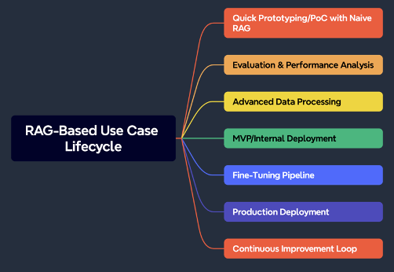

# Building RAG workflows with Amazon SageMaker AI and Amazon Bedrock

Welcome to **Building Retrieval Augmented Generation (RAG) Workflows with Amazon SageMaker and Amazon Bedrock**!

In this workshop, you will journey through all the steps of building the GenAI components of a RAG application starting with experimentation and working your way through to repeatable and scalable components that will be part of production applications.

You'll start small, working in a SageMaker Studio environment with a basic dataset to get through the fundamentals of embedding models, vector databases, and RAG orchestration. Having a basic application, your focus will shift to understanding and measuring the objective quality of outputs using different techniques for vector search and model output evaluation. Afterwards, you will build external components that will be more scalable, critical to getting to PoC/Pilot phases. Once you have those components in place, you'll learn different techniques to optimize the performance and quality of the system through adjusting parameters and even seeing where fine-tuning your models can be beneficial. Upon meeting performance and quality KPIs, focus on real-world readiness by implementing safety and security measures, such as guardrails to protect inputs and outputs.
