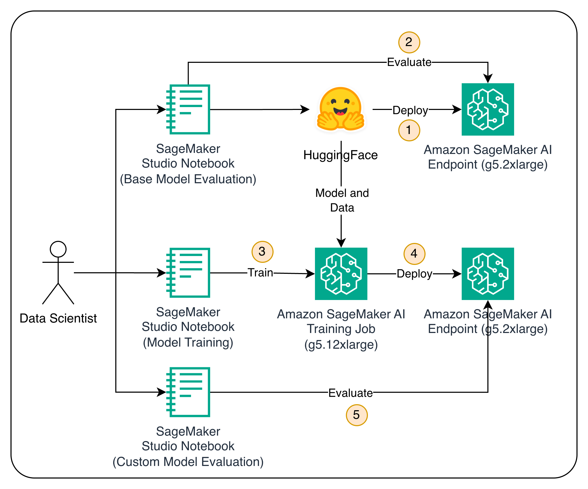
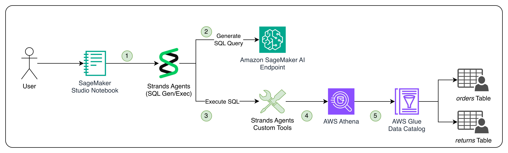

# Efficient AI Model Customization for Agentic Workflows using Amazon SageMaker AI

Join us to learn a practical and cost-effective way to customize AI models using spectrum-aware fine-tuning using the fully managed training experience provided by Amazon SageMaker training jobs. We'll demonstrate how this method precisely updates only the most important parts of an AI model, making the process faster and more affordable than traditional approaches. Through real-world examples, we'll show how to train language models for high-accuracy task completion and decision-making in agentic workflows. This session will provide you with hands-on knowledge to make your AI training more efficient, helping you save both time and money while building more capable AI agents.

## Architecture

### Model Training and Deployment

### Agent Development and Testing

## Notebooks

1. **0-setup.ipynb** - Workshop setup and configuration
2. **1-evaluate-base-Qwen3-model.ipynb** - Evaluate baseline Qwen3 model performance
3. **2-spectrum-aware-finetuning.ipynb** - Perform spectrum-aware fine-tuning using SageMaker
4. **3-evaluating-finetuned-Qwen3-model.ipynb** - Evaluate fine-tuned model performance
5. **4-agents.ipynb** - Build autonomous SQL assistant agents with Strands Agents SDK

## Prerequisites

- AWS account with SageMaker AI access
- Jupyter environment (SageMaker Studio recommended)
- Required Python packages (installed via setup notebook)
- Cross-account access to shared endpoints (for workshop environment)

## Getting Started

1. Clone this repository
2. Start with **0-setup.ipynb** to configure your environment
3. Run notebooks in sequence (0-4)
4. Follow the step-by-step instructions in each notebook

## Key Technologies

- Amazon SageMaker Training Jobs
- Amazon SageMaker ModelTrainer API
- Spectrum-aware fine-tuning
- Hugging Face Transformers
- Amazon Athena for SQL evaluation
- Strands Agents SDK for autonomous agents
- MLflow for experiment tracking

## Models Used

- **Qwen3 0.6B** and **Qwen3 4B** - Efficient reasoning model from Alibaba/Qwen
- **Base model**: Vanilla Qwen3 for baseline evaluation
- **Fine-tuned model**: Spectrum-aware fine-tuned version for SQL generation

## Datasets

- **Synthetic Text-to-SQL** - From Gretel AI for SQL generation training
- **Hermes Reasoning Tool Use** - For tool calling and reasoning capabilities
- **Retail Database** - Sample e-commerce data for evaluation (orders and returns tables)

## Workshop Structure

### Part 1: Model Evaluation and Fine-tuning

- Baseline model performance assessment
- Spectrum-aware fine-tuning implementation
- Performance comparison and analysis

### Part 2: Autonomous Agent Development

- Schema-guided agents with pre-defined knowledge
- Autonomous discovery agents that explore data independently
- Comparison of vanilla vs fine-tuned models in agent scenarios

## Key Features

- **Spectrum-aware Fine-tuning**: Cost-effective parameter selection for targeted model improvements
- **Cross-account Endpoint Access**: Shared model endpoints for workshop scalability
- **Comprehensive Evaluation**: SQL execution accuracy and performance metrics
- **Agent Frameworks**: Both guided and autonomous data exploration approaches
- **MLflow Integration**: Experiment tracking and model performance monitoring
