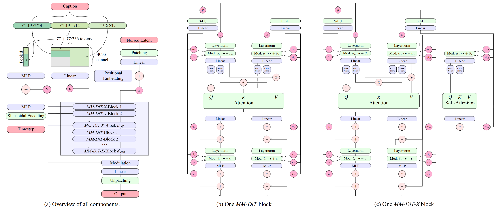

# Fine-Tuning Stable Diffusion 3.5 Medium on Amazon SageMaker AI

This workshop walks you through fine-tuning [Stable Diffusion 3.5 Medium](https://huggingface.co/stabilityai/stable-diffusion-3.5-medium) for character and style adherence using LoRA (Low-Rank Adaptation) on Amazon SageMaker AI. You will prepare a training dataset, run a distributed training job on SageMaker, and deploy the fine-tuned model to a real-time SageMaker endpoint for inference.

By the end of this workshop you will be able to generate images that match a specific character and art style defined by your training data.



## Overview

Stable Diffusion 3.5 Medium is a 2.5B parameter text-to-image model built on the MMDiT-X (Multi-Modal Diffusion Transformer) architecture. It uses three text encoders (CLIP-L/14, OpenCLIP bigG/14, and T5-XXL) to interpret prompts, a transformer-based diffusion backbone for denoising, and a VAE to move between pixel and latent space.

Rather than fine-tuning the full model, this workshop uses LoRA to train lightweight adapter weights on the transformer attention layers. This keeps training fast and memory-efficient while producing adapters that can be hot-swapped at inference time without duplicating the base model.

## Workshop Structure

| Notebook | Description | Estimated Time |
|---|---|---|
| `01 - data.ipynb` | Explore the training dataset — a set of captioned cartoon images of a boy named Malcom and his dog Ben | 5 min |
| `02 - training.ipynb` | Build a custom training container, upload data and base model to S3, configure and launch a SageMaker Training Job | 20–30 min |
| `03 - inference.ipynb` | Deploy the base model with LoRA adapters to a SageMaker real-time endpoint and compare outputs across adapters | 15–20 min |

## Prerequisites

- An AWS account with access to Amazon SageMaker AI
- A SageMaker Studio domain or notebook instance with an IAM execution role that has permissions for SageMaker, S3, and ECR
- A [HuggingFace account](https://huggingface.co/) with an API token — you must accept the [Stable Diffusion 3.5 Medium model terms](https://huggingface.co/stabilityai/stable-diffusion-3.5-medium) before downloading
- (Optional) A [Weights & Biases](https://wandb.ai/) account and API key for experiment tracking
- Familiarity with Python and Jupyter notebooks

### Instance Requirements

| Stage | Instance Type | GPUs | Notes |
|---|---|---|---|
| Notebooks | `ml.t3.medium` (or similar) | — | For running the notebook cells themselves |
| Training | `ml.g5.12xlarge` | 4x NVIDIA A10G (24 GB each) | Default recipe; a `ml.p4d.24xlarge` recipe is also provided for longer runs |
| Inference | `ml.g5.2xlarge` | 1x NVIDIA A10G (24 GB) | Hosts the base model + LoRA adapters |

> You may need to request a service quota increase for `ml.g5.12xlarge` and `ml.g5.2xlarge` instances in your region.

## What You Will Learn

1. **Data preparation** — How to structure a captioned image dataset for Stable Diffusion fine-tuning using the HuggingFace `datasets` library.
2. **Custom training containers** — How to build a PyTorch + CUDA training container, push it to Amazon ECR, and reference it from a SageMaker Training Job.
3. **LoRA fine-tuning on SageMaker** — How to configure a recipe-based training run using HuggingFace Accelerate with Distributed Data Parallel (DDP) across multiple GPUs.
4. **SageMaker model deployment** — How to deploy a Stable Diffusion model to a real-time endpoint using a managed HuggingFace inference container with custom inference code.
5. **Multi-adapter inference** — How to load multiple LoRA adapters alongside a single base model and switch between them at request time.

## Repository Layout

```
stable-diffusion-35-finetuning/
├── 01 - data.ipynb                  # Data exploration notebook
├── 02 - training.ipynb              # Training notebook
├── 03 - inference.ipynb             # Inference and deployment notebook
├── utils.py                         # Helper utilities
├── data/                            # Sample training dataset (HF datasets format)
│   └── train/
├── images/                          # Architecture diagrams
├── training/
│   ├── Dockerfile                   # Custom training container
│   ├── requirements.txt             # Training container dependencies
│   ├── build_and_push_to_ecr.sh     # Script to build and push container to ECR
│   └── training-scripts/
│       ├── base.sh                  # Entrypoint script for SageMaker Training Jobs
│       ├── train_text_to_image_lora.py  # LoRA training script
│       ├── accelerate_configs/      # HuggingFace Accelerate configs (DDP)
│       └── recipes/                 # Training hyperparameter recipes
├── inference/
│   └── code/
│       ├── inference.py             # Custom inference handler (model loading + adapter switching)
│       └── requirements.txt         # Inference dependencies
└── lora_adapters/
    └── adapters/
        └── boy-cartoon/             # Pre-trained reference adapter
```

## Key Training Parameters

The default recipe (`recipes/default-medium-g5_12x.yaml`) uses the following configuration:

| Parameter | Value | Description |
|---|---|---|
| `rank` | 4 | LoRA matrix rank |
| `resolution` | 512 | Training image resolution |
| `train_batch_size` | 1 | Per-GPU batch size (limited by A10G memory) |
| `gradient_accumulation_steps` | 10 | Simulates an effective batch size of 10 |
| `max_train_steps` | 100 | Total training steps |
| `learning_rate` | 1e-4 | Learning rate with cosine scheduler |
| `lora_layers` | Attention projections + linear layers | Which transformer layers receive LoRA adapters |

A longer-running recipe for `ml.p4d.24xlarge` is also included with a batch size of 8, 1000 training steps, and more validation images.

## Getting Started

1. Open SageMaker Studio or a SageMaker notebook instance.
2. Clone this repository or upload the `stable-diffusion-35-finetuning` folder.
3. Open `01 - data.ipynb` and run through the cells sequentially.
4. Continue with `02 - training.ipynb` to build the container and launch training.
5. Finish with `03 - inference.ipynb` to deploy and test the model.

> Each notebook installs its own dependencies and restarts the kernel as needed. Follow the instructions in each notebook and wait for kernel restarts before continuing.

## Cleanup

To avoid ongoing charges, delete the following resources after completing the workshop:

- The SageMaker real-time endpoint created in notebook 03
- The SageMaker model object
- The ECR repository and container image
- Training data and model artifacts in S3
- Any SageMaker warm pool instances (if `keep_alive_period_in_seconds` was set)

## Security

See [CONTRIBUTING](../../CONTRIBUTING.md) for more information.

## License

This project is licensed under the terms in the [LICENSE](../../LICENSE) file.
